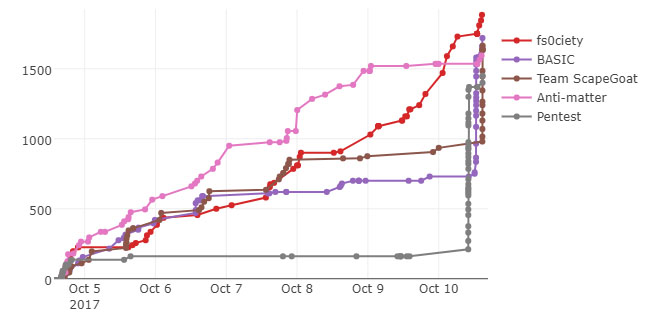

# Platy's GCTF Challenges
Challenges included in the Gryphon Capture The Flag Competition 2017

This is my personal repo of the challenges that were used in Singapore Polytechnic's annual Gryphon CTF

It was a blast writing these challenges!

Congratulations to Team `[NC] DankBankPink` for solving all of my challenges!

## Content Page
- [Scoreboard](#scoreboard)
- [Challenges](#challenges)
	- [Are you ready?](#are-you-ready)
	- [Crypto](#crypto)
	- [Forensics](#forensics)
	- [Misc](#misc)
	- [Programming](#programming)
	- [Pwn](#pwn)
	- [Reversing](#reversing)
	- [Sanity](#sanity)
	- [Web](#web)
- [Creator's Note](#creators-note)
- [Credits](#credits)

# Scoreboard
Congrats to the top 5 competiting teams
1. fs0ciety
2. BASIC
3. Team ScapeGoat
4. Anti-matter
5. Pentest

Full Scoreboard

| Place | Team               | Score |
|-------|--------------------|-------|
| 1     | [NC] Creators      | 3125  |
| 2     | [NC] DankBankPink  | 2735  |
| 3     | [NC] Red           | 2400  |
| 4     | fs0ciety           | 1885  |
| 5     | BASIC              | 1720  |
| 6     | Team ScapeGoat     | 1665  |
| 7     | Anti-matter        | 1595  |
| 8     | Pentest            | 1450  |
| 9     | Fatm00se           | 1350  |
| 10    | [NC] tryhards      | 980   |
| 11    | PogChamp           | 970   |
| 12    | Threadripper       | 905   |
| 13    | hackerboiis        | 590   |
| 14    | Pre-eminence       | 560   |
| 15    | Placeholder        | 540   |
| 16    | AFK                | 175   |
| 17    | Wil did IoTs       | 155   |
| 18    | SYNners            | 140   |
| 19    | [NC] Subway Surfer | 125   |
| 20    | XiaoNerd           | 100   |
| 21    | Unique             | 75    |
# Challenges
## Are you ready?
- [Cringeyroll 0](Cringeyroll) (17 solves)

## Crypto
- [Crypto Hotdogs 45](Crypto%20Hotdogs) (9 solves)
- [Time to Crypt 55](Time%20to%20Crypt) (6 solves)

## Forensics
- [Powerpoint 15](Powerpoint) (11 solves)
- [Potato's Brain Sprain 25](Potato's%20Brain%20Sprain) (13 solves)

## Misc
- [Haxor wallpaper 20](Haxor%20wallpaper) (20 solves)
- [Hell's Programmer 15](Hell's%20Programmer) (18 solves)
- [MESSY_CHEESE 30](MESSY_CHEESE) (12 solves)
- [Up the Base 25](Up%20the%20Base) (5 solves)

## Programming
- [Coin Miner 30](Coin%20Miner) (12 solves)
- [Find mah monehs 120](Find%20mah%20monehs) (9 solves)
- [Lecturer Says 20](Lecturer%20Says) (11 solves)

## Pwn
- [Bashing 150](Bashing) (3 solves)

## Reversing
- [Depresso Espresso 60](Depresso%20Espresso) (4 solves)

## Sanity
None.

## Web
- [Cookie Monster 60](Cookie%20Monster) (9 solves)
- [Fish Shoups 50](Fish%20Shoup) (12 solves)
- [My nice site 10](My%20nice%20site) (19 solves)
- [Saving Gaia 100](Saving%20Gaia) (3 solves)

# Creator's Note
All my challenges are easy.

Continue Hacking Harder!

# Credits
<i>Creator - @PlatyPooper</i>

### Creators that I collaborated with
<i>Creator - @paux &amp; @stopduckroll</i>

### Special Mention
<i>Creator - @LFlare</i>
